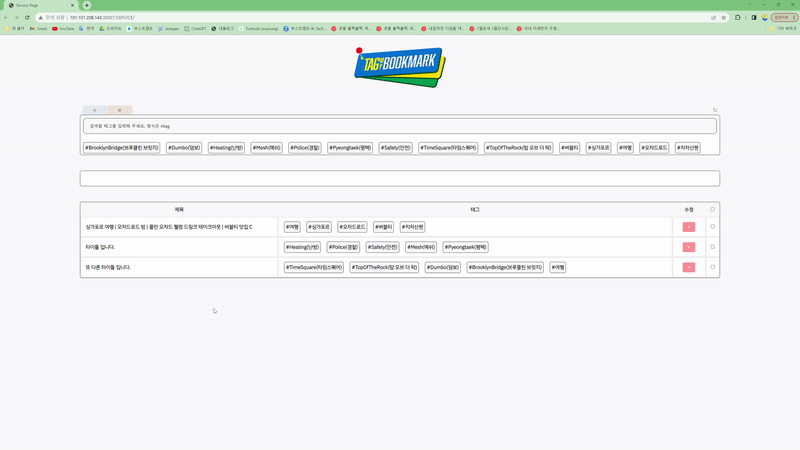
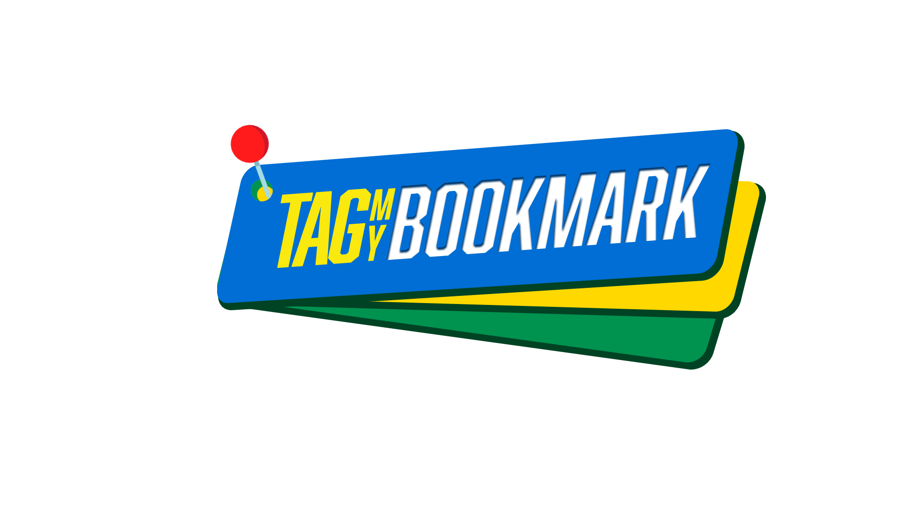
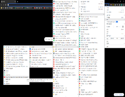
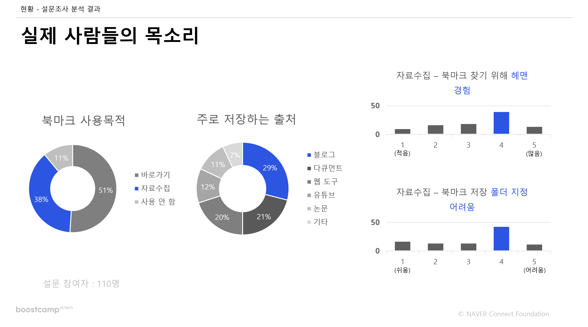
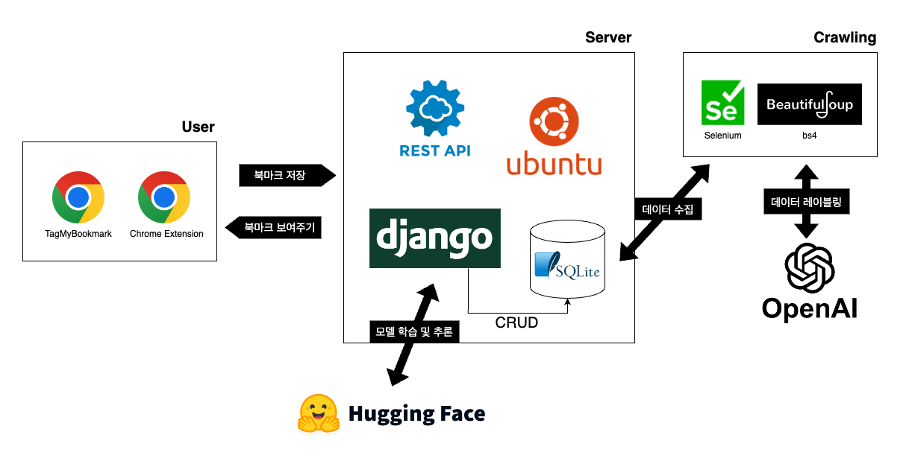

  

 # 🏷️ TagMyBookmark!

- 팀명: NLP 02조 강남특공대
- 인원: 5명
- 주최: 부스트캠프 ai tech 5기 | 최종 프로젝트
- 프로젝트 기간: 2023년 6월 30일 ~ 2023년 7월 28일
- 주제: 북마크 자동 분류
- 개발 스택: `REST API` , `Django` , `Chrome Extensions` , `SQLite` , `Hugging Face` , `JavaScript`

# 0. 목차
[1. 팀원](#1-팀원)    
[2. Tag My Bookmark!](#2-tagmybookmark!)    
&emsp; [📺 Demo](#📺-demo) 
&emsp; [🔎 서비스 소개](#🔎-서비스-소개)
&emsp; [💡 개발 이유](#💡-개발-이유)
&emsp; [👨‍👩‍👧‍👦 서비스 대상](#👨‍👩‍👧‍👦-서비스-대상)     
[3. How to use](#3-how-to-use)    
[4. 참고 자료 🗂️](#4-참고-자료-🗂️)    
[5. Project Pipeline](#5-project-pipeline)    
&emsp; [🛠️ Service Architecture](#🛠️-service-architecture)
&emsp; [📑 Dataset](#📑-dataset)
&emsp; [💻 Front-End](#💻-front-end)
&emsp; [📦 Back-End](#📦-back-end)
&emsp; [🤗 Model](#🤗-model)    

# 1. 팀원

<table>
    <tr height="160px">
        <td align="center" width="150px">
            
             
            <a href="https://github.com/gibum1228"><strong>김기범</strong></a>
             
        </td>
        <td align="center" width="150px">
            
             
            <a href="https://github.com/heejinsara"><strong>박희진</strong></a>
             
        </td>
        <td align="center" width="150px">
            
             
            <a href="https://github.com/LewisVille-flow"><strong>이주형</strong></a>
             
        </td>
        <td align="center" width="150px">
            
             
            <a href="https://github.com/Forbuds"><strong>천소영</strong></a>
             
        </td>
        <td align="center" width="150px">
            
             
            <a href="https://github.com/rustic-snob"><strong>천재원</strong></a>
             
        </td>
    </tr>
</table>

#  2. TagMyBookmark!
## 📺 Demo
&emsp; 
## 🔎 서비스 소개
<!-- ### `Tag My Bookmark`는  `북마크 페이지`에 대한 `태그`를 생성, 효과적인 `페이지 관리`를 돕는 서비스입니다. -->
<table align="center">
    <tr height="160px">
        <td align="center" width="300px">
            
        </td>
        <td align="left" width="550px">
        <h3><b>Tag My Bookmark</b>는 북마크 페이지</b>에 대한 <b>태그를 생성</b>, 효과적인 <b>북마크 페이지 관리</b>를 돕는 서비스입니다.</h3>
        </td>
    </tr>
</table>
별도의 가입 없이 크롬 익스텐션으로 간단하게 북마크 관리를 도와주는 도구입니다.

## 💡 개발 이유
   
<table>
    <tr height="160px">
        <td align="center" width="300px">
            
        </td>
        <td align="center" width="300px">
            
        </td>
        <td align="center" width="300px">
         
        </td>
    </tr>
    <tr height="5px" style="border-top: hidden;">
        <td align="center" width="300px">
        💢 눈 깜짝할 사이에 쌓여버린 북마크
        </td>
        <td align="center" width="300px">
        💢 그때 그 북마크, 어디에 저장했더라?
        </td>
        <td align="center" width="300px">
        💢 어디에 정리하죠, 내 북마크?
        </td>
    </tr>
</table>

&emsp;파일 구조로 정리하는 기존의 북마크, 불편하지 않으신가요?   
&emsp;`자동 북마크 관리`, 필요하지 않으세요?

## 👨‍👩‍👧‍👦 서비스 대상

<b>서비스 대상과 방향</b>을 구체화 하기 위해 사람들이 북마크를 어떻게 쓰는지 <b>설문조사</b>를 해 봤습니다.

    

        &emsp; 
        
        분석 결과 설문 참여자의 38%가 북마크를 <b>자료수집</b> 용도로 사용한다는 것을 알 수 있었으며,    
        주로 <b>블로그 포스트</b>를 북마크에 저장한다는 것을 알 수 있었습니다.
         
         
        또한 예상했던 바와 같이 <b>북마크를 찾기 위해 헤멘 경험</b>이 있거나 
        <b>북마크를 저장하기 위해 폴더를 지정하는데에 어려움을 겪은 경험</b>이 있는 비율이 높음도 확인할 수 있었습니다.
         
         
        따라서 저희는 다음과 같이 서비스를 제공할 대상을 특정하였습니다.
    

&emsp;     

- 북마크를 <b>`자료 수집용`</b>으로 사용하는 유저
- <b>`블로그 포스트`</b>를 북마킹 하는 유저
- 북마크를 <b>`저장할 폴더 지정이 어려운`</b> 유저
- 저장해 둔 <b>`북마크 검색`</b>에 어려움을 겪는 유저
## 🧭 서비스 개발 방향
- 기존 크롬 북마크 사용자 유입
- 사용자 편의 - 액션 최소화
- 북마크 관리 편의성

# 3. How to use
- [시연 영상](https://youtu.be/AtSmRwAwZrM)
- [TagMyBookmark 사용 설명서](https://github.com/boostcampaitech5/level3_nlp_finalproject-nlp-02/blob/readme/asset/Tag%20My%20Bookmark!.pdf)

# 4. 참고 자료 🗂️

- [발표 자료 PPT]()
- [발표 영상]()
- [Wrap-up Report]()

# 5. Project Pipeline
### 🛠️ Service Architecture    
    
&emsp; 

### 📑 Dataset
- Dataset 구축
    - 수집 방법: Selenium, BeautifulSoup
    - 출처: 블로그 포스트(Tistory, Naver, Velog)
- [OpenAI API를 이용한 정답 라벨 생성](https://github.com/boostcampaitech5/level3_nlp_finalproject-nlp-02/tree/main/data)
### 💻 Front-End
- [Web](https://github.com/boostcampaitech5/level3_nlp_finalproject-nlp-02/tree/main/web)
    - [Web/Extention](https://github.com/boostcampaitech5/level3_nlp_finalproject-nlp-02/tree/main/web/extension)
    - [Web/ServicePage](https://github.com/boostcampaitech5/level3_nlp_finalproject-nlp-02/tree/main/web/myapp/SERVICE)
### 📦 Back-End
- [Django](https://github.com/boostcampaitech5/level3_nlp_finalproject-nlp-02/tree/main/web/myapp)
- [RestAPI](https://github.com/boostcampaitech5/level3_nlp_finalproject-nlp-02/tree/main/web/myapp/API)
### 🤗 Model
- [Tag generation Model](https://github.com/boostcampaitech5/level3_nlp_finalproject-nlp-02/tree/main/model)

&emsp;     
&emsp;     
&emsp;     
&emsp;     
&emsp;     
&emsp;     
