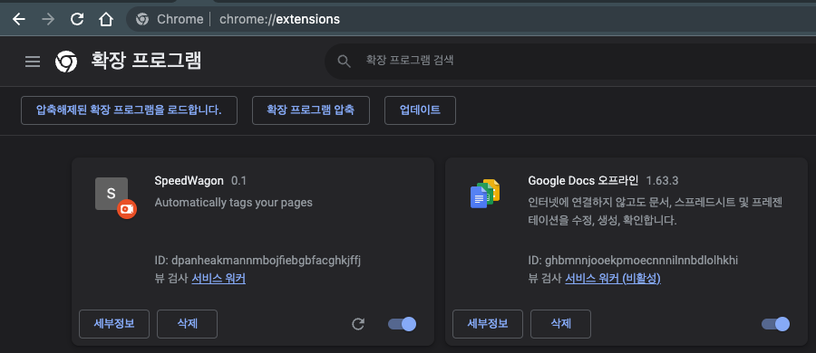

# Custom Chrome Extension
1. 확장 프로그램 관리 창 접속("chrome://extensions/")
2. 우측 상단 **개발자 모드** on
3. 왼쪽 상단 **"압축해제된 확장 프로그램을 로드합니다."** 버튼 클릭
    3-1. manifest.json 이 포함된 extension 폴더 자체를 업로드(선택)
4. "SpeedWagon"이라는 이름의 custom extension이 추가되는 것을 확인할 수 있음.
    

        
        <figcaption align="center">[사진 1] 커스텀 크롬 익스텐션 추가 후 모습</figcaption>
    

5. 우측 상단 익스텐션 탭에서 사용이 가능.
